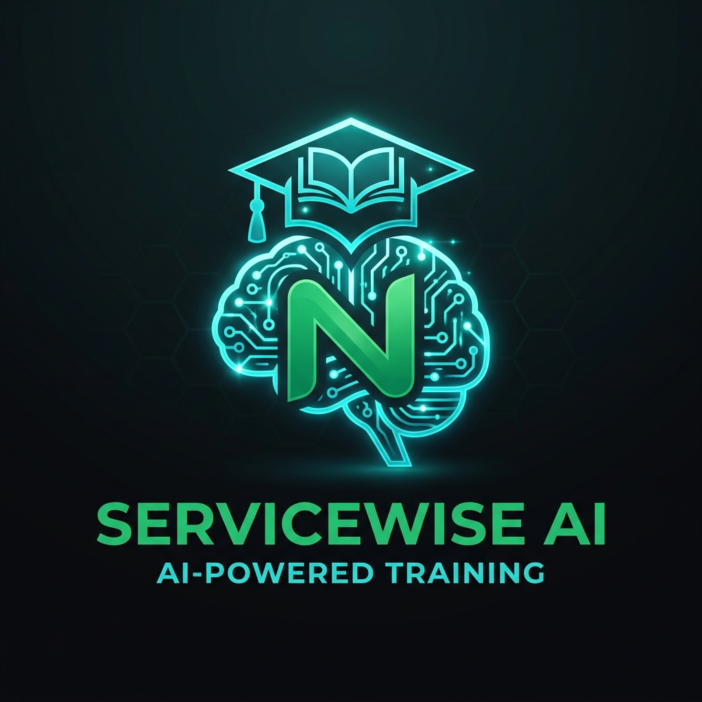
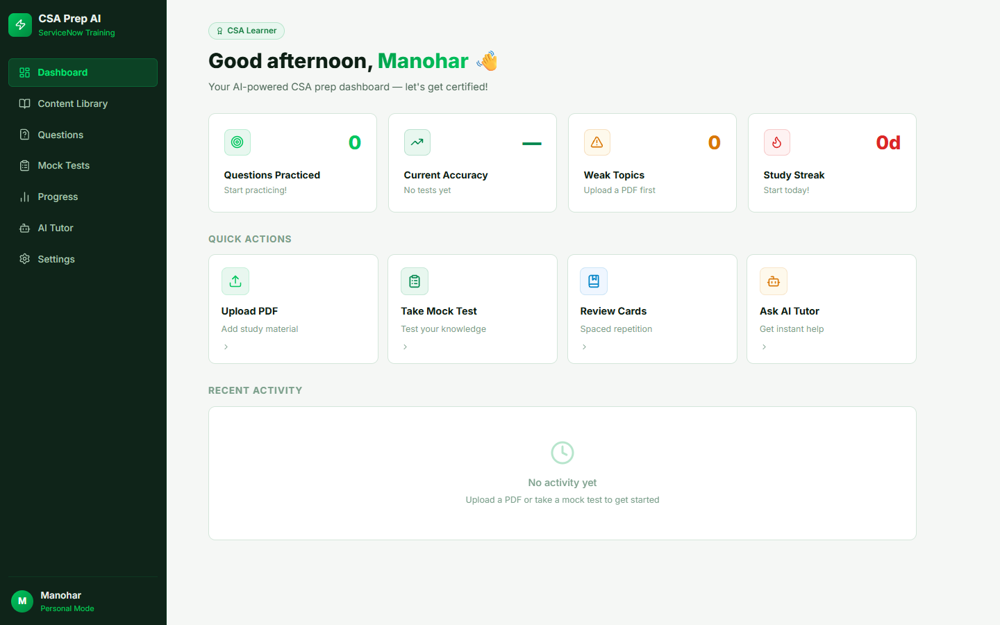
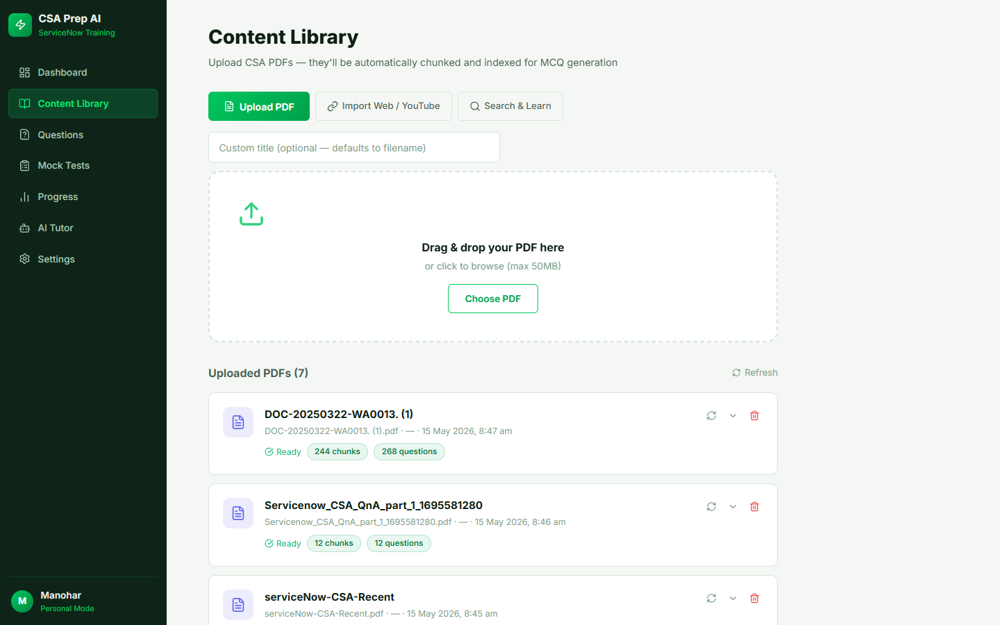
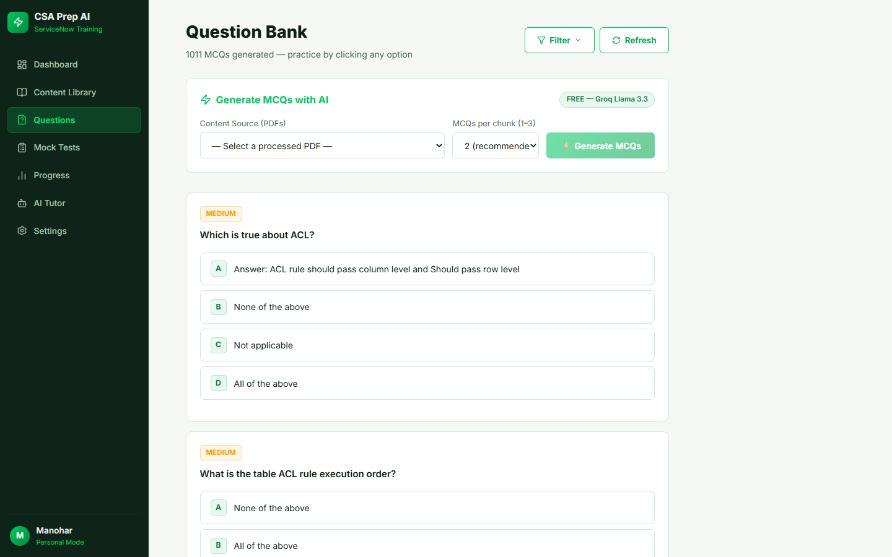
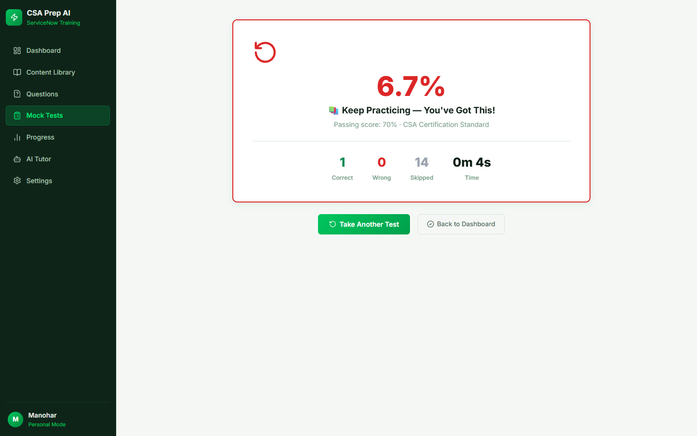
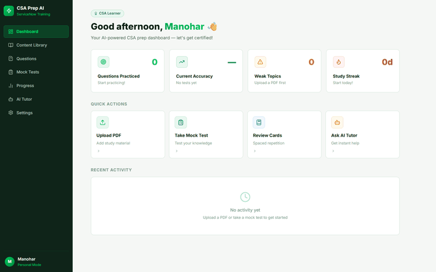
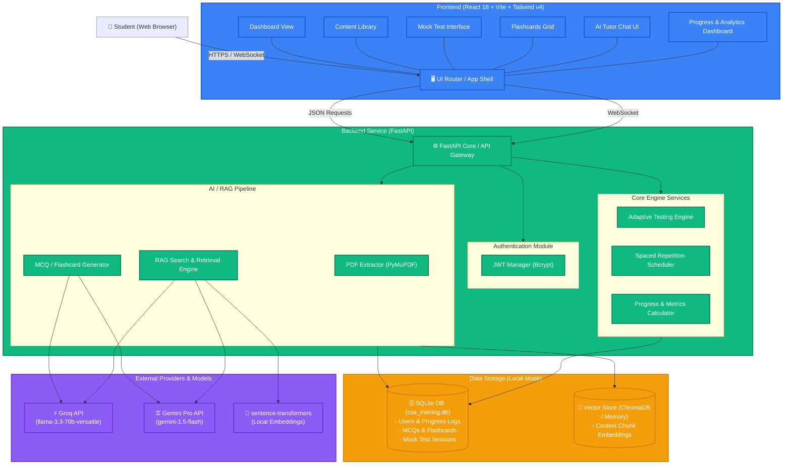

# 🎓 ServiceNow CSA AI-Powered Training App

<div align="center">
  

  <p><strong>An Intelligent, RAG-Driven Adaptive Learning System for ServiceNow CSA Exam Preparation</strong></p>

  <div>
    
    
    
    
  </div>
</div>

---

## 🎯 Recruiter & Technical Review Highlight

This repository demonstrates the construction of a complete, production-ready AI agent application, custom-tailored to solve a real-world problem: **accelerating ServiceNow CSA certification prep**. 

Key technical accomplishments showcased in this codebase:
- **Asynchronous FastAPI Architecture**: High-speed, rate-limited python server utilizing async database pools (`aiosqlite`) and streaming responses (SSE) for real-time LLM interactions.
- **Advanced RAG Ingestion Pipeline**: Auto-parsing complex PDF materials using `PyMuPDF`, chunking with sliding overlaps, embedding, and matching using vector operations to serve as context for the LLM.
- **Intelligent Question Generation**: Automatically extracts and synthesizes scenario-based Multiple Choice Questions (MCQs) and Spaced Repetition flashcards directly from study materials, complete with detailed concept explanations.
- **Adaptive Performance Engine**: A custom telemetry tracker assessing student accuracy, time spent per topic, and failing patterns, adapting subsequent mock exam compositions to target weak areas.

---

## 🚀 Key Features

* **📚 Automated Ingestion**: Ingest PDF textbooks, ServiceNow Release Notes, and study guides. Custom parsing automatically flags existing questions or generates new ones.
* **🧠 RAG AI Tutor**: Interactive chat assistant querying the local document vectors to answer complex conceptual questions (e.g., *“What is the difference between client scripts and business rules?”*) with exact citation sources.
* **📝 Dynamic Mock Tests**: Timed, real-format mock exams (100 questions, 120 minutes) with auto-save, question marking, navigation panels, and visual score reports.
* **📊 Heatmap Analytics**: Advanced tracking of accuracy per ServiceNow domain (e.g., User Interface, Database Administration, Automation, Scripting) with failure recovery recommendation.
* **⚡ Spaced Repetition Flashcards Grid**: CSS flip-animated flashcards dynamically scheduled based on study history (Day 1, 3, 7, 30 interval checks).

---

## 📸 Application Screenshots

<div align="center">
  <h3>📊 Performance Dashboard</h3>
  

  <h3>📚 Content Library & Ingestion</h3>
  

  <h3>📝 Active Mock Test Interface</h3>
  

  <h3>🏆 Results & Weakness Breakdown</h3>
  
</div>

---

## 🖥️ Live Walkthrough

*Below is an automated walkthrough of the application shell navigating the Dashboard, Mock Exam, Flashcard, and AI Tutor pages:*

<div align="center">
  
</div>

---

## 🛠️ System Architecture

Detailed block diagram illustrating data flows from the React frontend, through the FastAPI routes, to the SQLite database and LLM API integrations:

> Read the full [Architecture Specification](docs/architecture.md) for a deep dive.



---

## 💻 Installation & Quickstart

Follow these steps to run the application in a local Personal Mode environment.

### Prerequisites
- Python 3.10+
- Node.js v18+

### 1. Backend Setup
1. Navigate to the backend directory:
   ```bash
   cd csa-training-app/backend
   ```
2. Copy the sample environment file:
   ```bash
   cp .env.example .env
   ```
3. Open `.env` and fill in your preferred LLM provider API key (e.g., `GROQ_API_KEY` or `GEMINI_API_KEY`).
4. Activate your virtual environment and install packages:
   ```bash
   pip install -r requirements.txt
   ```
5. Start the FastAPI server:
   ```bash
   python run.py
   ```
   *The server runs at `http://127.0.0.1:8000`. API docs can be viewed at `/docs`.*

### 2. Frontend Setup
1. In a new terminal tab, navigate to the frontend directory:
   ```bash
   cd csa-training-app/frontend
   ```
2. Install Node modules:
   ```bash
   npm install
   ```
3. Run the Vite development server:
   ```bash
   npm run dev
   ```
   *Open `http://localhost:5173` to start practicing!*

---

## 🛠️ Code Structure

```text
csa-training-app/
├── backend/
│   ├── app/
│   │   ├── api/routes/    # REST endpoints (auth, questions, tests, tutor)
│   │   ├── core/          # App config, dependencies, exceptions
│   │   ├── db/            # SQLAlchemy session setup and DB migrators
│   │   ├── models/        # SQLAlchemy database schemas
│   │   ├── schemas/       # Pydantic validation schemas
│   │   ├── services/      # RAG pipeline, question generator, spaced repetition
│   │   └── main.py        # FastAPI initialization & startup routines
│   ├── run.py             # Uvicorn launcher
│   └── csa_training.db    # SQLite Database containing pre-loaded study data
├── frontend/
│   ├── src/
│   │   ├── api/           # Axios REST services
│   │   ├── components/    # Reusable UI widgets (Sidebar, layout elements)
│   │   ├── context/       # Auth state context
│   │   ├── pages/         # Dashboard, Content, Questions, Tests, Tutor, Settings
│   │   ├── App.jsx        # Routing configuration
│   │   └── index.css      # Custom styles tailored for ServiceNow green theme
│   └── vite.config.js     # Dev server proxy configuration
```

---

## 📝 License

Distributed under the MIT License. See [LICENSE](LICENSE) for more information.
