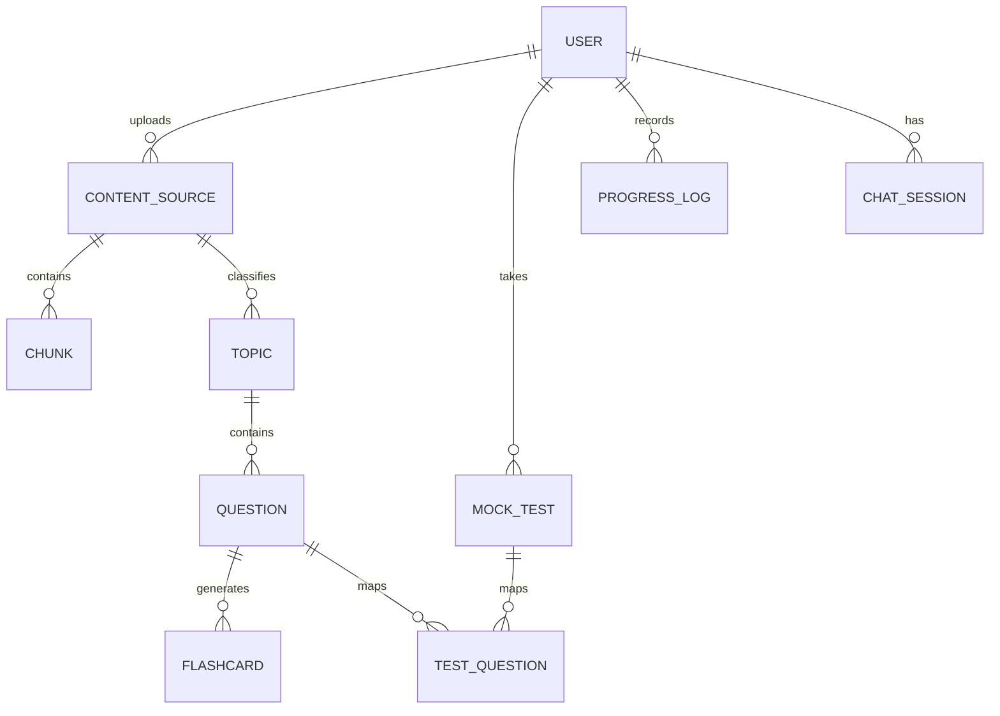

# Technical Project Analysis — CSA AI Training App

This document provides a deep dive into the design decisions, code organization, database schemas, and AI execution pipelines of the Certified System Administrator (CSA) AI-Powered Training Application.

---

## 📖 Project Overview

Preparing for the ServiceNow Certified System Administrator (CSA) certification involves reading hundreds of pages of textbooks, release notes, and community posts. This application solves three primary challenges:
1. **Inefficient Information Retrieval**: Replaces manual searching through PDFs with a **Retrieval-Augmented Generation (RAG) AI Tutor** that extracts contextual references instantly.
2. **Generic Mock Testing**: Replaces generic static exams with an **Adaptive Testing Engine** that tracks a student's weak domains and structures custom practice exams focusing on these specific weaknesses.
3. **High Cognitive Load**: Automates the extraction of Multiple Choice Questions (MCQs) and Spaced Repetition flashcards directly from custom PDFs, enabling self-paced study.

---

## 🗂️ Codebase Architecture

The application is decoupled into a React frontend client and an asynchronous FastAPI Python backend:

### 1. Backend Service Layer (`/backend/app/services`)
- **PDF Extraction (`pdf_service.py`)**: Utilizes `PyMuPDF` to parse textual content page-by-page. Content is split into chunks of 300–500 characters with a 50-character sliding overlap to maintain context boundaries.
- **RAG & Tutor Engine (`tutor_service.py`)**: Vectorizes query text, performs semantic matching against stored chunks, extracts the top-scoring content windows, and prompts the LLM (Groq / Gemini) with structural context constraints.
- **MCQ Generation (`mcq_service.py`)**: Ingests textbook pages and prompts the LLM to write scenario-based multiple-choice questions matching official ServiceNow formatting standards.
- **Analytics & Weakness Tracking (`analytics_service.py`)**: Aggregates question attempts to compute real-time accuracy percentages across the six core ServiceNow certification domains.

### 2. Frontend Interface (`/frontend/src/pages`)
- **Dashboard (`Dashboard.jsx`)**: Displays general progress telemetry (total questions practiced, current average accuracy %, study streak, and domain heatmaps).
- **Mock Tests (`MockTests.jsx`)**: Multi-phase state machine managing:
  - Timed session timers.
  - Interactive navigation (Previous, Next, Question Navigator grid).
  - Question review flagging.
  - Final results scorecard displaying correct/wrong counts, elapsed time, and domain weakness analytics.
- **Flashcards Grid (`Flashcards.jsx`)**: Responsive card layouts implementing 3D flip effects via CSS transitions.

---

## 🗄️ Database Schema & Data Models

SQLite is used for local state management. The database (`csa_training.db`) is structured with the following key tables:

### Table Definitions
1. **User**: Registry of credentials (stored with Bcrypt hashes). Supports multi-tenant configuration (running in single-user personal mode).
2. **ContentSource**: Documents metadata (file name, path, page count, and ingestion status).
3. **Chunk**: Represents raw vectorizable text blocks extracted from files, referencing their source pages.
4. **Topic**: ServiceNow learning domains (e.g., *Database Administration*, *Self Service & Automation*).
5. **Question**: Ingested or AI-generated MCQs (question statement, options A–D, correct answer, and conceptual explanation).
6. **Flashcard**: Front/Back cards tied to topics for scheduled memory drills.
7. **MockTest**: Records session statistics (test type, overall score %, elapsed time, status, and creation date).
8. **TestQuestion**: Junction table mapping questions to mock tests, tracking user choices, elapsed answer times, and reviewing flags.
9. **UserProgress**: Telemetry recording every question attempt (correctness, response latency, and timestamps).

---

## ⚡ Key Technical Decisions

### FastAPI & Asynchronous Database Calls
- **Why FastAPI**: High performance, native support for python coroutines, and automatic interactive OpenAPI schemas (`/docs`).
- **Why aiosqlite**: Standard `sqlite3` blocks the python event loop during disk operations. Utilizing `sqlalchemy.ext.asyncio` with the `aiosqlite` driver ensures database read/writes are non-blocking, maintaining API throughput during background PDF processing.

### Modular LLM Adapters
- The application implements a flexible adapter pattern in `backend/app/services/` that abstracts the LLM backend. Users can toggle between:
  1. **Groq Cloud (Llama 3.3)**: Highly recommended for development due to single-digit millisecond latency.
  2. **Google Gemini Pro**: Used for large-context reasoning during textbook processing.
  3. **Local Ollama (Llama 3.2)**: For offline setup requiring no external API keys.

### CSS-First Micro-Animations
- Avoids large React animation libraries (like Framer Motion) to minimize bundle sizes.
- Animations (card flips, warning timers, loading spinners, and grid fades) are executed via hardware-accelerated CSS keyframes and custom transitions in `index.css`.
