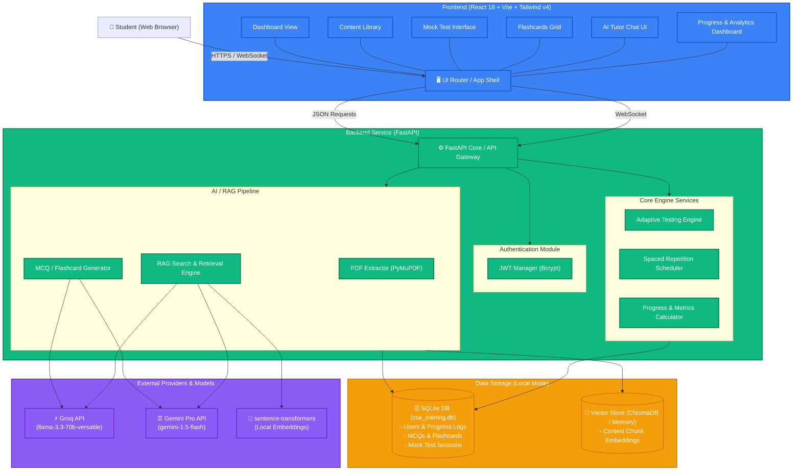

# System Architecture Specification

This document details the architectural components, data flows, and technical stack of the ServiceNow Certified System Administrator (CSA) AI-Powered Training Application.

## Overview

The application is structured as a modern, decoupled Single Page Application (SPA) frontend communicating with an asynchronous, high-performance REST API backend. It runs in a **Personal Dev Environment** (Local Mode) using lightweight SQLite and local indexing, with connections to remote LLM APIs (Groq or Google Gemini).

---

## Component Details

### 1. Presentation Layer (Frontend)
- **Framework**: React 18, scaffolded with Vite for extremely fast compile and reload times.
- **Styling**: Vanilla CSS structure paired with Tailwind CSS v4, customized with a ServiceNow signature green brand style (#00c65e, dark slate sidebar).
- **Navigation**: Client-side routing managed by React Router Dom.
- **State Management**: Context-driven architecture for persistent layouts and session caching.

### 2. Services Layer (Backend)
- **API Core**: FastAPI (Python 3.13) leveraging async route handlers and standard Pydantic models.
- **PDF Extraction**: Ingests textbooks, ServiceNow developer docs, and custom mock exams using **PyMuPDF**, extracting clean unstructured text, detecting topics, and splitting documents into logical chunks.
- **RAG Pipeline**: Leverages local embeddings to vectorize PDF document chunks, indexing them in ChromaDB or an in-memory representation. During chat sessions or question generation, relevant contexts are queried and injected into the LLM prompt.
- **Adaptive Engine**: Uses scoring history, question latency, and topic failure frequencies to construct custom test sessions dynamically (e.g., 60% weak topics, 30% medium topics, 10% strong topics).

### 3. Storage Layer
- **Relational Metadata**: SQLite (accessed via SQLAlchemy and the async `aiosqlite` driver). Stores project entities including:
  - `User`: Personal developer profile.
  - `ContentSource`: Registry of imported PDFs.
  - `Question`: Ingested or AI-generated MCQs (storing options, correctness, and conceptual explanations).
  - `Flashcard`: Ingested or auto-generated flashcards for spaced repetition.
  - `MockTest` / `TestQuestion`: State machines of active mock test instances and answer selections.
  - `UserProgress`: Tracks correct answers and topics to support the weakness analysis heatmap.
- **Vector DB**: ChromaDB database or in-memory vector storage containing vector embeddings of raw content.
